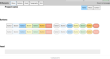
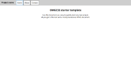
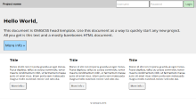
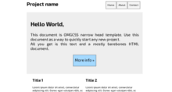

# OMGCSS

OMGCSS is an extremely lightweight css framework (9.1kB).

However we try to focus on availability (support multi-devices) with responsive elements,
functionalities with the most possible useful elements, and simplicity.

## Elements

- Container (default takes 90%, but can be fixed too (see narrow head template))
- Menus, Static Menu or Inline Menu (in-page)
- Buttons (nice colors, default flat design, available rounded style)
- Head (top article with bigger font)
- Grid system (2, 3 or 4 columns)
- Grid blocks can be merged.
- Messages system. (These generally contain important infos)
- Forms (with nice inputs)

- Nice colors (can apply to buttons, menu buttons, forms input, messages, grid blocks)

### See Elements

## Templates

We provide templates to help you create a website using it as a base application.

### Starter-template

### Head-template

### Narrow Head-template

## Quotes

>«OMGCSS changed my life. I found a job, a wife and now have a kid thanks to omgcss!» - John Doe

## Licence

This whole project with its templates is provided under the MIT License (MIT)
